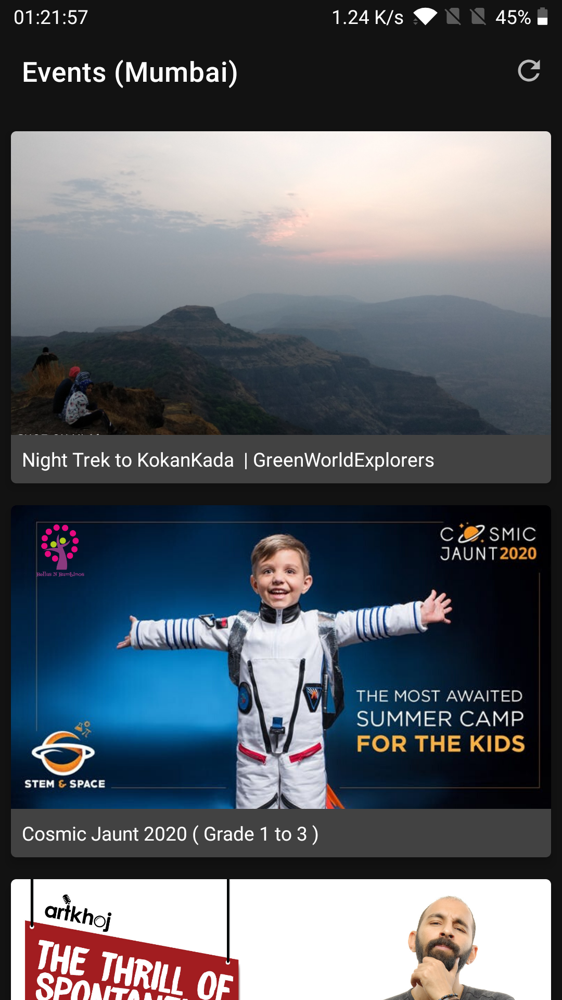
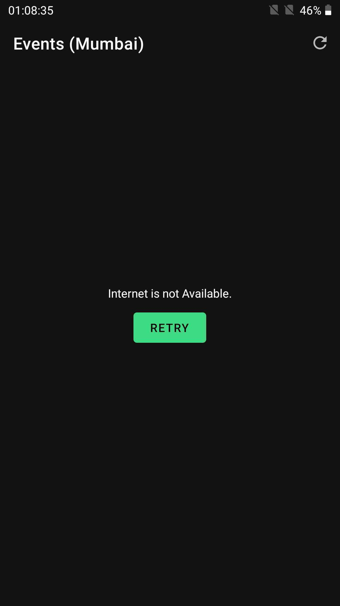

## Events using Paytm Insider APIs

Poc app which showcases Events in a city using Paytm Insider APIs

[Download](https://github.com/vishal1337/Events/raw/master/apk_file/app_debug.apk) APK to try the App

<table>
  <tr>
    <td>Event List</td>
    <td>Offline State</td>
  </tr>
  <tr>
    <td></td>
    <td></td>
  </tr>
</table>

# Highlights

- MVVM Architecture - To Organize Code
- Kotlin - Language used to write this Project
- Coroutines - To make use of suspend functions while making API calls
- Retrofit - Network Library
- Glide - Image Loading Library
- GSON - Json Parsing Library
- Timber - Used for Logging
- Data Binding - To avoid boilerplate and attach the View to LiveData directly.
- LiveData - Observable data holder class
- ViewModel - to store and manage UI-related data in a lifecycle conscious way
- Dagger2 - For Dependency Injection
